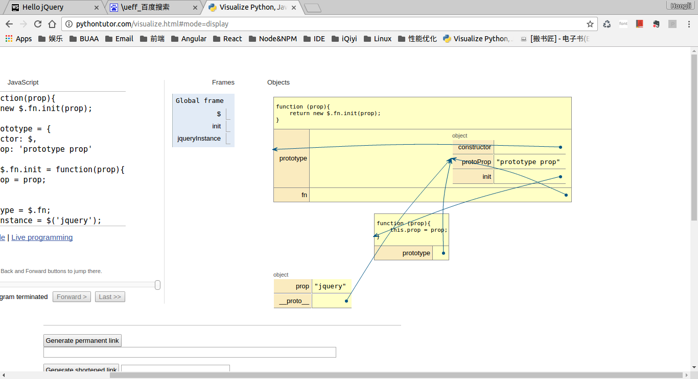

# learn jQuery

## 生成jQuery对象

在`jQuery`中，使用函数直接调用的方式来生成一个新的`jQuery`对象。

```javascript
var instance = $(selector);
```

但是只有使用`new`的构造方式调用函数才能令实例的`__proto__`指向构造函数的`prototype`对象。因此我们需要在中间加一层额外的构造函数，具体做法如下:

```javascript
var $ = function(prop){
    return new $.fn.init(prop);
};
$.fn = $.prototype = {
    constructor: $,
    protoProp: 'prototype prop'
};
var init = $.fn.init = function(prop){
    this.prop = prop;
};

init.prototype = $.fn;
var jqueryInstance = $('jquery');

console.log(jqueryInstance.prop); // "jquery"
console.log(jqueryInstance.protoProp); // "prototype prop"
```

概括来说就是：

1. `jQuery()`返回的是`prototype`对象上`init()`构造函数的实例。
2. `init()`的原型对象就是`jQuery()`的原型对象。
3. 使用`init()`生成(即调用`jQuery()`方法)的对象就可以继承`init()`的`prototype`(即`jQuery()`的`prototype`)上的属性或方法。

